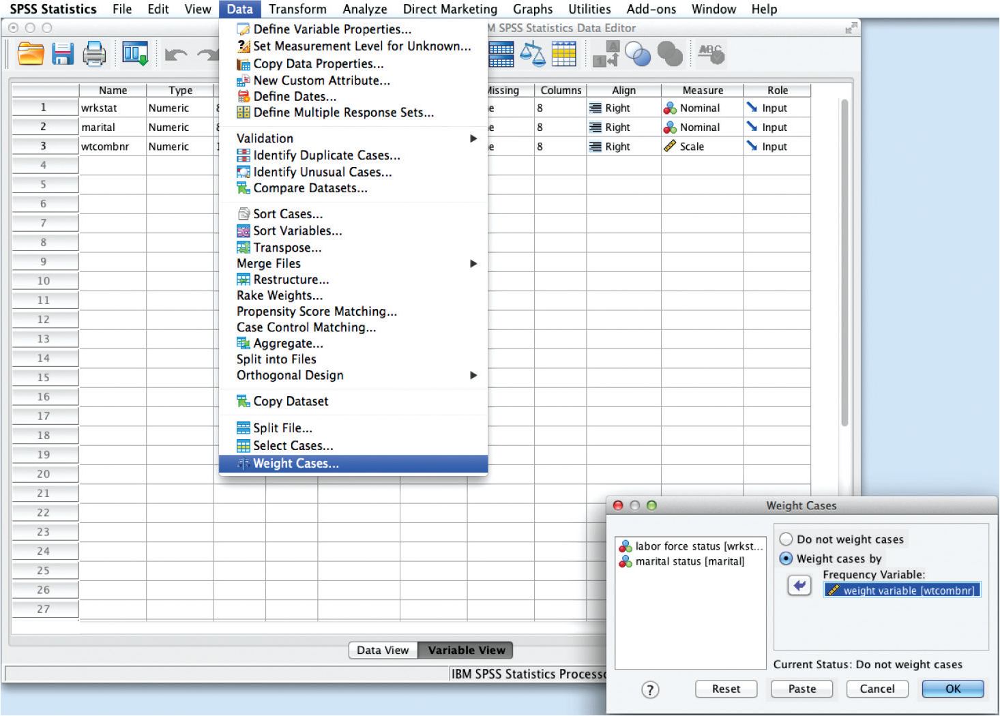
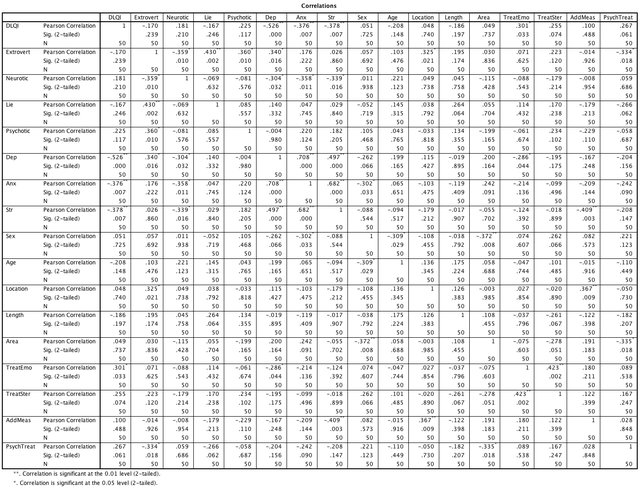
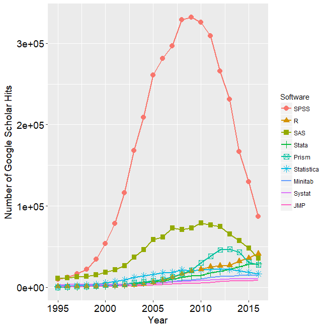

```{r setup, include=FALSE}
# options(htmltools.dir.version = FALSE)
knitr::opts_chunk$set(warning = FALSE, message = FALSE)
library(tidyverse)
library(cowplot) # configure the images
voxnum_ori <- read_table2("data/data.voxnum.txt") %>% select(-contains("cingulate"))
```


# 数据处理需求
.pull-left[

### 核心：统计运算和可视化
- 数据清理
    - 不同实验程序输出的文件(eprime)
    - 不同来源的数据文件(.csv, .xlsx, .txt, .tsv, ...)
- 数据理解
  - 图
  - 统计模型
  - 循环往复
- 综合报告

]

.pull-right[
.center[.red[数据处理流程概览]]


]

---
# Excel+SPSS?
.pull-left[
.center[]
]

.pull-right[

- 人见人爱的Excel，功能强大
  - 优点: 所见即所得; 非常flexible; 可以进行大部分的统计分析
  - 缺点: 容易出错;非常慢; 批处理需要学习VBA，不通用

- 人见人爱的SPSS，心理学学生必修课
  - 优点: 有使用经验?
  - 缺点: 无法进行数据清理;几乎无法进行数据的transform; 冗余信息过多; .red[画图丑爆]...

- 通常需要两者结合使用
  - 缺点: .red[累]，但是我懒
  

]
---
# 劝退事件之一: 相关矩阵
.pull-left[
]

.pull-right[
- 复制到Excel
- 删除矩阵的一半
- 删除p/n等无关信息
- 添加显著星号标识
- ...]

---
class: center middle


---
# 劝退事件之二: 重复计算
.pull-left[
举例.red[56个变量配对计算]

audvis功能磁共振成像的数据
- 刺激类型: 汉字，拼音
- 实验条件: print, speech
- ROIs: IFG, STG, AG, FG (lh和rh)

使用`AFNI`提取了汉字和拼音在print和speech条件下激活的.red[体素数量]。

计算ROIs左右半球的体素数量之和。

]

.pull-right[.boxed[
```{r, echo=FALSE,eval=TRUE}
voxnum_ori <- read_table2("data/data.voxnum.txt") %>% select(-contains("cingulate"))
glimpse(voxnum_ori)
```
]]

---
class: center middle

.red[SPSS + Excel?]


---
# 程序语言的优势

.pull-left[
.center[谷歌学术引用情况<sup>*</sup>]
```{r,echo=FALSE}

```

]


.pull-right[
### 大量重复操作
### 可重复性
### 方便修改和纠错
### 最新的工具
### ...

.footnote[[*]http://r4stats.com/articles/popularity/]
]
---
# 用啥程序语言?
.center[
```{r echo=FALSE}
p1 <- ggdraw() + draw_image("plots/matlablogo.png")
p2 <- ggdraw() + draw_image("plots/Rlogo.svg", scale = 0.6)
p3 <- ggdraw() + draw_image("plots/pythonlogo.png")
p4 <- ggdraw() + draw_image("plots/bashlogo.png")
plot_grid(p1,p2,p3,p4)
```
]

---
class: center, middle

.red[
## 小孩子才做选择，大人全都要！！！
]

---
# 区分一个概念
编程语言 vs. 集成开发环境(Integrated development environment, IDE)。

--
- R语言常用的集成开发环境是Rstudio
.center[
```{r,fig.show="hold",fig.align="center",out.height="20%",out.width="20%", echo=FALSE}
knitr::include_graphics("plots/rstudiologo.png")
```
]

--

- Python常用的集成开发环境非常多，可以根据喜好选择
.center[
```{r,fig.show="hold",out.width="10%",out.height="10%",echo=FALSE}
knitr::include_graphics(c("plots/jupyterlogo.png","plots/pycharm-logo.png","plots/spyderlogo.png"))
```
]

--

- Others, 地表最强IDE
```{r, fig.align="center",out.height="20%",out.width="20%", echo=FALSE}
knitr::include_graphics("plots/visualstudiologo.png")
```

---
# 首尾呼应之一: Correlation Matrix
.pull-left[
```{r, eval=FALSE, echo=TRUE}
df <- read_csv("data/data_293_repeats.csv") %>% 
  select(contains("f5"))

sjPlot::tab_corr(df, triangle = "lower", digits = 2) #<<
```

]


.pull-right[.boxed[
```{r, eval=TRUE, echo=FALSE,size="tiny"}
df <- read_csv("data/data_293_repeats.csv") %>% 
  select(contains("f5"))

sjPlot::tab_corr(df, triangle = "lower", digits = 2) #<<
```

]]

---
# 首尾呼应之一: Correlation Matrix

.pull-left[
```{r, eval=FALSE, echo=TRUE}
df_cor <- read_csv("data/data_293_repeats.csv") %>% 
  select(contains("f5")) %>% cor(use = "pairwise.complete.obs")

corrplot::corrplot(df_cor, method = "number", type = "upper",
                   mar = c(0, 0, 0, 0)) #<<
```

]

.pull-right[.boxed[
```{r, eval=TRUE, echo=FALSE, size="small",out.height="90%",out.width="90%"}
df_cor <- read_csv("data/data_293_repeats.csv") %>% 
  select(contains("f5")) %>% cor(use = "pairwise.complete.obs")

corrplot::corrplot(df_cor, method = "number", type = "upper") #<<
```
]]

---
# 首尾呼应之二: 56个变量配对计算
.pull-left[使用简单的代码即可完成手工几乎不可能做到的任务：
- 提取变量中unique的所有值(`*.lh`和`*.rh`)
- 循环选择数据中unique的变量并进行相加，命名合并至原数据集。
```{r rois, echo=TRUE, results='hide', out.height=3,out.width=3}
# variables to use
var_all <- names(voxnum_ori)[grepl("^(voxnum)\\.(vis|aud)", x = names(voxnum_ori))]
# filter unique vars
var_uniq <- var_all %>% str_sub(1, -3) %>% unique() 
# new dataset
var_uniq %>% 
    map(~ voxnum_ori %>% #<<
            select(matches(.x)) %>% #<<
            reduce(`+`)) %>% #<<
            set_names(paste0(var_uniq, "both")) %>% 
            bind_cols(voxnum_ori, .) %>% 
  select(contains("both")) %>% 
  glimpse()
```

]

.pull-right[.boxed[

```{r, echo=FALSE,eval=TRUE}
# variables to use
var_all <- names(voxnum_ori)[grepl("^(voxnum)\\.(vis|aud)", x = names(voxnum_ori))]
# filter unique vars
var_uniq <- var_all %>% 
    str_sub(1, -3) %>% 
    unique() 
# new dataset
var_uniq %>% 
    map(~ voxnum_ori %>% 
            select(matches(.x)) %>% 
            reduce(`+`)) %>% 
            set_names(paste0(var_uniq, "both")) %>% 
            bind_cols(voxnum_ori, .) %>% 
  select(contains("both")) %>% 
  glimpse()

```
]]

---
background-image: url("plots/yay.jpg")
background-size: cover
background-position: 50% 50%

---
class: center middle inverse
# Demo
教育部数据清理之chaintest
